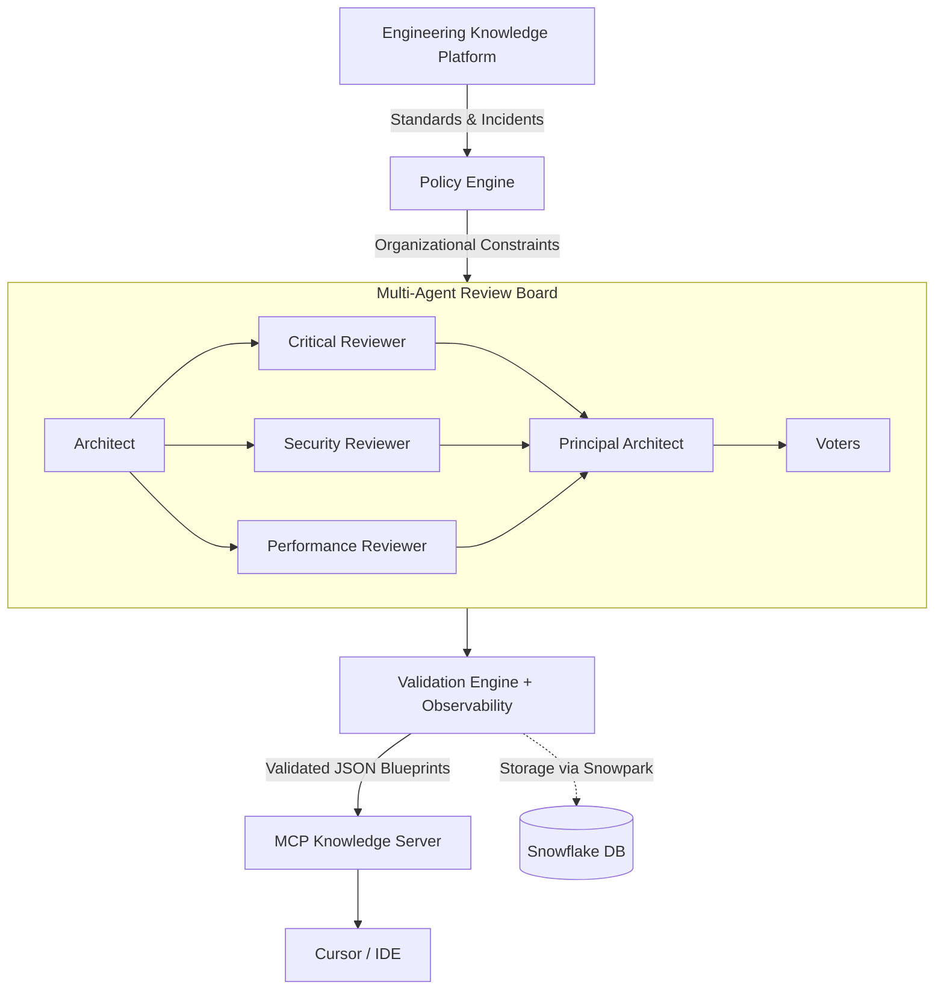

# StructZero - Enterprise Engineering Intelligence Platform

**StructZero - Enterprise Engineering Intelligence Platform** is built natively on Snowflake Cortex. It goes far beyond a simple LLM wrapper—it acts as an autonomous AI architecture review board. By combining a Progressive Knowledge Platform, Multi-Agent Debate Engine, comprehensive Telemetry, and an MCP Server, it helps engineering teams design, review, validate, and evolve production software systems securely using their own internal enterprise wisdom.

---

## 🏗️ Architecture Overview

The system is decomposed into a clean separation of concerns, operating as independent, interacting engines:



For a deep dive into the subsystems (Knowledge Loader, Decision Logs, Evidence Summaries, and Telemetry), see our detailed architecture document: **[docs/architecture.md](docs/architecture.md)**.

---

## 🚀 How to Install and Run

### 1. Prerequisites
- **Python 3.11+**
- **uv**: We use `uv` for lightning-fast dependency management (`pip install uv`).
- **Snowflake Account**: You need access to a Snowflake instance with Cortex AI enabled.

### 2. Clone and Install
```bash
git clone https://github.com/vishalvermauts/StructZero-Enterprise-Engineering-Intelligence-Platform.git
cd StructZero-Enterprise-Engineering-Intelligence-Platform

# Sync dependencies using uv
uv sync
```

### 3. Environment Variables
Create a `.env` file in the root directory and add your Snowflake credentials:

```env
SNOWFLAKE_ACCOUNT=your_account_locator
SNOWFLAKE_USER=your_username
SNOWFLAKE_PASSWORD=your_password
SNOWFLAKE_ROLE=your_role
SNOWFLAKE_WAREHOUSE=your_warehouse
SNOWFLAKE_DATABASE=STRUCTZERO_DB
SNOWFLAKE_SCHEMA=ENTERPRISE
```

### 4. Setup Snowflake Schema
Before running the application, you need to create the `STRUCTZERO_DB` database and the dynamic JSON tables. Run the setup script:
```bash
uv run python -m core.setup_schema
```
*(This will safely drop and recreate the necessary JSON variant tables: PROJECTS, BLUEPRINTS, DEBATE_SESSIONS, OBSERVABILITY, KNOWLEDGE_REGISTRY, etc.)*

### 5. Run the Platform

**To run the UI Dashboard locally (Streamlit):**
```bash
uv run streamlit run streamlit_app.py
```
This will launch the interactive Enterprise Dashboard locally.

**To deploy directly into Snowflake Native Streamlit (SiS):**
```bash
snow streamlit deploy structzero_dashboard --replace --prune --database STRUCTZERO_DB --schema ENTERPRISE
```
This deploys the dashboard natively inside your Snowflake account securely.

**To run the end-to-end backend test pipeline:**
```bash
uv run python test_pipeline.py
```

**To run the MCP Server (for Cursor/IDE integration):**
```bash
uv run python -m mcp.run
```

---

## 📂 Code Structure & Components

The repository is modularly designed into distinct enterprise components:

### `core/` (The Engine)
- **`pipeline.py`**: The orchestration heart of the system. Manages the lifecycle of a request from Knowledge Ingestion -> Architect -> Reviewers -> Synthesizer -> Validation -> Snowflake Storage.
- **`agents.py`**: Contains the system prompts and wrappers for the Cortex LLMs. Defines the personas for the Architect, Security Reviewer, Performance Reviewer, and the Principal Architect (Synthesizer).
- **`cortex_gateway.py`**: An abstraction over `snowflake.cortex.Complete()`. It dynamically routes models, estimates token usage, and calculates approximate USD costs for observability.
- **`storage.py`**: The Snowflake storage layer using Snowpark. Saves massive JSON blobs into Snowflake `VARIANT` columns using double-dollar `$${...}$$` string escaping.
- **`knowledge_loader.py` & `loaders/`**: The plugin-based knowledge orchestrator. Scans the `/knowledge` directory, parses Markdown frontmatter, calculates MD5 checksums, and chunks data for the Enterprise Brain.
- **`validators.py`**: A deterministic Python rules engine that scores the final AI blueprints out of 100 based on security and performance rules.

### The Interface
- **`streamlit_app.py`**: A rich Streamlit dashboard. It renders real-time Mermaid.js diagrams, displays the AI's "Evidence Summary", and provides a granular telemetry sidebar (tracking latency, Cortex API calls, and estimated costs).

### `knowledge/` (The Enterprise Brain)
- A mock directory structure (`aws/`, `security/`, `incidents/`, `patterns/`) containing Markdown files. The system ingests these at runtime, allowing the Architect to explicitly cite internal company policies (e.g., PCI-DSS constraints) in its blueprints.

### `mcp/` (The IDE Server)
- **`server.py` & `run.py`**: Exposes the Snowflake intelligence directly to local developer tools using the Model Context Protocol (`mcp.server.fastmcp`). This allows developers to query architecture blueprints directly from Cursor or Claude Desktop.

---

## 🗺️ Future Enterprise Roadmap

While StructZero is fully functional today, its native Snowflake architecture unlocks massive future potential:

| Priority | Feature                     | Judge Impact                              |
| -------- | --------------------------- | ----------------------------------------- |
| ⭐⭐⭐⭐⭐    | **Cortex Search**               | Native Enterprise RAG                     |
| ⭐⭐⭐⭐⭐    | **Cortex Analyst**              | AI-powered engineering analytics          |
| ⭐⭐⭐⭐⭐    | **Snowpark Container Services** | Native parallel multi-agent orchestration |
| ⭐⭐⭐⭐     | **Native App Marketplace**      | Enterprise deployment story               |
| ⭐⭐⭐⭐     | **Engineering Memory Graph**    | Self-improving AI platform                |
| ⭐⭐⭐      | **Tasks & Streams**             | Asynchronous background execution         |
| ⭐⭐       | **Hybrid Tables**               | Future multi-user SaaS scalability        |
| ⭐        | **Fine-Tuning**                 | Long-term research item                   |

### Phase 1: Native Enterprise Knowledge (Cortex Search)
Replacing custom chunking/retrieval with fully managed **Cortex Search**. This provides out-of-the-box hybrid search (vector + keyword) over enterprise knowledge bases, enabling semantic search with zero custom retrieval code.

### Phase 2: AI-Powered Analytics (Cortex Analyst)
Since StructZero stores all engineering telemetry in native Snowflake tables, **Cortex Analyst** can be plugged directly into the platform. Executives can ask natural language questions like *"Which cloud provider produced the highest architecture quality score this quarter?"* and instantly receive SQL-driven analytical answers.

### Phase 3: Parallel AI Orchestration (Snowpark Container Services)
Moving the multi-agent orchestration engine into **Snowpark Container Services (SPCS)**. This will allow the Architect, Security, and Performance agents to debate concurrently in parallel across distributed compute nodes natively inside Snowflake.

### Phase 4: Enterprise Deployment (Snowflake Native App Marketplace)
Packaging StructZero as an installable **Snowflake Native App**. Enterprises can install the entire Intelligence Platform directly into their own Snowflake accounts with one click, securely maintaining 100% of their proprietary architecture data and policies inside their own perimeter.

### Phase 5: Self-Improving Platform (Engineering Memory Graph)
Transforming past blueprints into an **Enterprise Memory Graph**. Every architecture generated becomes a node in the knowledge graph. When future architects design systems, the AI natively learns from the successes and failures of previous architectures.
