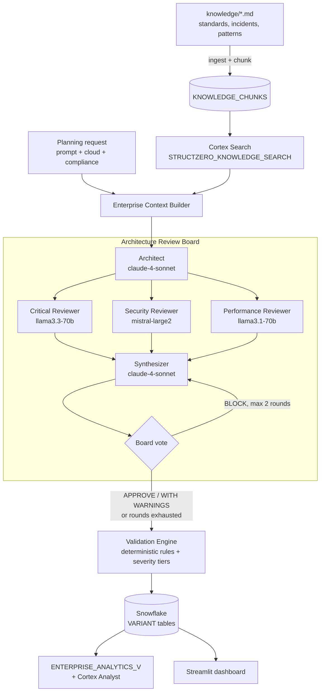

# StructZero — Enterprise Engineering Intelligence Platform

An autonomous AI architecture review board built natively on Snowflake Cortex.

You describe a system you want to build. StructZero produces an architecture blueprint that has
been **drafted, adversarially reviewed, revised and validated** — then persists the whole audit
trail as queryable Snowflake data. The product is not the document. The product is the
*assurance* attached to it.

---

## Table of contents

- [What it does](#what-it-does)
- [Architecture](#architecture)
- [The pipeline, stage by stage](#the-pipeline-stage-by-stage)
- [The review board and revision loop](#the-review-board-and-revision-loop)
- [The validation engine](#the-validation-engine)
- [Knowledge platform](#knowledge-platform)
- [Telemetry and observability](#telemetry-and-observability)
- [Analytics via Cortex Analyst](#analytics-via-cortex-analyst)
- [Data model](#data-model)
- [Tech stack](#tech-stack)
- [Install and run](#install-and-run)
- [Configuration](#configuration)
- [Measured behaviour](#measured-behaviour)
- [Known limitations](#known-limitations)
- [Roadmap](#roadmap)

---

## What it does

1. **Retrieves internal standards.** Markdown policies, security standards and post-incident
   reports are chunked and indexed into Snowflake, then retrieved per request via Cortex Search
   with metadata filters on cloud target and compliance regime.
2. **Drafts an architecture.** A Principal Architect persona produces version 1.
3. **Reviews it adversarially.** Three specialist personas — Critical, Security and Performance —
   critique the draft against the retrieved enterprise standards. Each runs on a different model.
4. **Synthesizes version 2.** A synthesizer folds all three critiques into a revised blueprint
   with a Decision Log recording what was Accepted, Rejected or Modified.
5. **Votes.** The same three reviewers vote on whether their concerns were resolved:
   `APPROVE`, `APPROVE WITH WARNINGS`, or `BLOCK`.
6. **Remediates.** A `BLOCK` sends the design back to the synthesizer with the blocking concerns
   attached, for up to two revision rounds.
7. **Validates deterministically.** A Python rules engine checks the final document for defects
   that can genuinely be absent, and grades severity.
8. **Persists everything.** Blueprint, version history, debate transcript, per-rule validation
   findings, run record and full telemetry land in Snowflake VARIANT tables.

---

## Architecture


```mermaid
flowchart TD
    KB[knowledge/*.md<br/>standards, incidents, patterns] -->|ingest + chunk| KC[(KNOWLEDGE_CHUNKS)]
    KC --> CS[Cortex Search<br/>STRUCTZERO_KNOWLEDGE_SEARCH]
    REQ[Planning request<br/>prompt + cloud + compliance] --> CTX[Enterprise Context Builder]
    CS --> CTX

    CTX --> ARCH[Architect<br/>claude-4-sonnet]

    subgraph BOARD [Architecture Review Board]
        ARCH --> CR[Critical Reviewer<br/>llama3.3-70b]
        ARCH --> SR[Security Reviewer<br/>mistral-large2]
        ARCH --> PR[Performance Reviewer<br/>llama3.1-70b]
        CR --> SYN[Synthesizer<br/>claude-4-sonnet]
        SR --> SYN
        PR --> SYN
        SYN --> VOTE{Board vote}
        VOTE -->|BLOCK, max 2 rounds| SYN
    end

    VOTE -->|APPROVE / WITH WARNINGS<br/>or rounds exhausted| VAL[Validation Engine<br/>deterministic rules + severity tiers]
    VAL --> STORE[(Snowflake<br/>VARIANT tables)]
    STORE --> ANALYTICS[ENTERPRISE_ANALYTICS_V<br/>+ Cortex Analyst]
    STORE --> UI[Streamlit dashboard]
```

The revision arrow from `VOTE` back to `SYN` is the core of the design: a reviewer objection
changes the artefact rather than being recorded and ignored.

---

## The pipeline, stage by stage

`core/pipeline.py` → `PlanningPipeline.run()` is a generator, yielding a state dict per stage so
the UI can stream progress.

| Step | Stage | Model | Typical |
|-----|-------|-------|---------|
| 0 | Enterprise Context Builder | deterministic | <1s |
| 1 | Architect (V1) | claude-4-sonnet | 20-45s |
| 2 | Critical Reviewer | llama3.3-70b | 20-40s |
| 3 | Security Reviewer | mistral-large2 | 10-35s |
| 4 | Performance Reviewer | llama3.1-70b | 7-25s |
| 5 | Synthesizer (V2) | claude-4-sonnet | 38-50s |
| 51-53 | Board vote ×3 | all three reviewers | ~10s |
| 55 | Revision round (conditional) | claude-4-sonnet | ~40s per round |
| 6 | Production Validator | deterministic | ~1ms |
| 7 | Snowflake Storage | deterministic | <1s |

**Baseline: 8 Cortex calls, ~130-175s, ~$0.12.** Each revision round adds 4 calls
(1 synthesis + 3 votes).

Model routing is centralised in `core/model_router.py`:

```python
MODEL_ROUTER = {
    "architect":   "claude-4-sonnet",
    "critical":    "llama3.3-70b",
    "security":    "mistral-large2",
    "performance": "llama3.1-70b",
    "synthesizer": "claude-4-sonnet",
}
```

Reviewers run **sequentially**, not in parallel — Streamlit in Snowflake does not support
concurrent threading on a shared Snowpark session. Each is timed individually.

---

## The review board and revision loop

Each reviewer returns a verdict on its own first line, parsed by `PlanningPipeline.parse_vote()`:

```
APPROVE
APPROVE WITH WARNINGS
BLOCK
```

If any reviewer returns `BLOCK`, the pipeline collects the blocking reasons, labels them by
reviewer, and calls `SynthesizerAgent.revise()` with the blocked document plus those concerns.
The board then votes again on the revised document.

- Loop exits as soon as no reviewer blocks
- Hard cap of `MAX_REVISION_ROUNDS = 2`
- If blocks persist after two rounds, `board_decision = "BLOCK"` and the blueprint is `REJECTED`
  with the unresolved concerns recorded

A `BLOCK` surviving two remediation attempts is a genuinely useful output: *three specialist
reviewers could not resolve these concerns, here they are*. That is an escalation signal, not a
product failure.

---

## The validation engine

`core/validators.py` deliberately checks **substance that can be absent**, not vocabulary. Checks
that pass merely because a document contains the word "compliance" or "latency" are worthless —
the same system that writes the document is told which headings to include.

Current checks:

| Check | Category | Severity |
|---|---|---|
| Core sections present | Completeness | error |
| Graphviz or Mermaid diagram block present | Completeness | error |
| Multiple diagram blocks | Consistency | warning |
| Diagram nodes described in prose (orphan detection) | Consistency | error |
| Compliance-regime obligations for the selected target | Compliance | error / warning |
| Target regime never mentioned | Compliance | error |
| Numeric commitments answering numeric requirements in the prompt | Performance | error / warning |
| Risks listed with no mitigation stated | Completeness | error |
| Encryption in transit or at rest | Security | error |
| Review board blocked | Consistency | error |
| Review board approved with reservations | Consistency | warning |

Compliance obligations are per-regime. GDPR requires data residency, lawful basis and DPA;
HIPAA requires PHI handling, de-identification and BAAs; SOC2 requires change management. A
document that says "compliance" ten times but never mentions data residency fails a GDPR target.

### Verdict severity tiers

```python
SEVERE_ERROR_CATEGORIES = ("Security", "Compliance")

if board_decision == "BLOCK":   REJECTED   # board veto, after remediation attempts
elif overall < 80:              REJECTED
elif blocking:                  REJECTED   # a Security or Compliance error
elif errors or warnings:        APPROVED WITH WARNINGS
else:                           APPROVED
```

Rejection is reserved for material defects. A missing Roadmap section is a warning; an
unaddressed GDPR obligation is a rejection. `ValidationResult.blocking_categories` records *why*
something was rejected rather than leaving you to infer it.

---

## Knowledge platform

`core/knowledge_loader.py` walks `knowledge/`, parses JSON frontmatter, chunks on H2 boundaries
and upserts into Snowflake.

- **Change detection** by MD5 checksum, so unchanged files are skipped
- **`METADATA_SCHEMA_VERSION`** recorded per file; bumping it forces re-chunking even when file
  content is unchanged
- **Stable identity** — documents reuse the id recorded for their path, so re-ingestion updates
  in place rather than inserting duplicates
- **Idempotent** — a second run over unchanged files ingests 0 documents and 0 chunks

Chunk metadata carries full document provenance (source, category, tags, cloud, compliance,
technology, industry, priority, confidence, version, last_updated) plus any extra frontmatter
keys, so `KNOWLEDGE_SEARCH_VIEW` and the Cortex Search attribute list resolve without joining
back to the document table.

### Retrieval cascade

Filtered search is attempted in decreasing strictness, because a document with no `cloud` tag
applies to *every* cloud and must not be excluded:

1. `@and` of all filters (cloud, compliance, category)
2. `@or` of any filter
3. unfiltered

Without this cascade, any non-AWS target retrieves nothing from an AWS-tagged corpus, and the
context step silently reports success having contributed no grounding at all.

A legacy SQL retrieval path is retained as a fallback if Cortex Search is unreachable.

---

## Telemetry and observability

Every run writes an `ExecutionMetrics` record: per-agent latency (architect, review, security,
performance, synthesizer, validation, total), models used, Cortex call count, estimated input and
output tokens, estimated USD cost, per-category quality scores, revision rounds, and knowledge
corpus/retrieval counts.

Cost estimation lives in `core/cortex_gateway.py` at roughly $3/M input and $15/M output tokens.

**Metrics are reset at the start of every run.** The pipeline is cached with
`@st.cache_resource`, so the gateway instance is reused for the lifetime of the session; without
an explicit reset, call counts and cost accumulate and every run reports the session running
total instead of its own usage.

---

## Analytics via Cortex Analyst

`ENTERPRISE_ANALYTICS_V` flattens blueprints joined to telemetry: project, cloud target,
compliance target, validation status, overall/security/performance scores, total latency and
estimated cost.

A semantic model on `@ANALYST_MODELS/structzero_semantic_model.yaml` exposes 4 dimensions and 5
measures over that view, so natural-language questions work directly:

> *"Compare the average overall score and estimated cost by cloud target."*

`core/analyst.py` detects its environment. Inside Snowflake it routes through
`_snowflake.send_snow_api_request()`, which uses the app's own identity and needs no token or
external access integration. Locally it falls back to a REST call with the client session token.

---

## Data model

Everything is stored as `(ID VARCHAR, DATA VARIANT, CREATED_AT TIMESTAMP_NTZ)` in
`STRUCTZERO_DB.ENTERPRISE`.

| Table | Contents |
|---|---|
| `PROJECTS` | Project registry |
| `BLUEPRINTS` | Current blueprint per id, with request, markdown, diagram, validation |
| `BLUEPRINT_HISTORY` | Append-only snapshot of every version produced |
| `DEBATE_SESSIONS` | Full transcript: draft, three reviews, synthesis, three votes |
| `VALIDATIONS` | Validation verdict keyed by blueprint |
| `VALIDATION_RESULTS` | One row per finding (category score, error, warning) |
| `PIPELINE_RUNS` | One row per execution, including failures with error detail |
| `OBSERVABILITY` | Per-run `ExecutionMetrics` |
| `KNOWLEDGE_REGISTRY` | Ingested file → checksum → metadata schema version |
| `KNOWLEDGE_DOCUMENTS` | Parsed documents |
| `KNOWLEDGE_CHUNKS` | Chunks with full provenance metadata |
| `SEARCH_TELEMETRY` | Retrieval engine used, filters applied, result counts |
| `SKILLS`, `ENTERPRISE_MEMORY`, `PROJECT_MEMORY` | Reserved; not yet written by any code path |

Views: `ENTERPRISE_ANALYTICS_V`, `KNOWLEDGE_SEARCH_VIEW`.

All writes use **bound parameters**. Blueprint markdown routinely contains quotes, backslashes
and `$` sequences; a `$$`-delimited literal fails on input containing `$$$` (e.g. a budget figure
written `$$$45,000`), which raises SQL error 1304 and loses the run.

---

## Tech stack

- **Python 3.11**
- **Streamlit** — warehouse-backed Streamlit in Snowflake, or run locally
- **Snowpark** (`snowflake-snowpark-python`) — all data access
- **Snowflake Cortex `COMPLETE`** — 4 distinct models across 5 personas
- **Cortex Search** — `STRUCTZERO_KNOWLEDGE_SEARCH`, `TARGET_LAG = '1 minute'`, 12 attribute columns
- **Cortex Analyst** — natural-language analytics over the telemetry
- **Snowflake VARIANT tables** — schemaless JSON persistence
- **MCP server** (local) — exposes blueprints to Cursor / Claude Desktop

---

## Install and run

### Prerequisites

- Python 3.11+
- `uv` (`pip install uv`)
- A Snowflake account with Cortex AI enabled

### Clone and install

```bash
git clone https://github.com/vishalvermauts/StructZero-Enterprise-Engineering-Intelligence-Platform.git
cd StructZero-Enterprise-Engineering-Intelligence-Platform
uv sync
```

### Create the schema

```bash
uv run python -m core.setup_schema
```

Creates the database, schema, VARIANT tables (`CREATE TABLE IF NOT EXISTS` — existing data is not
dropped), `KNOWLEDGE_SEARCH_VIEW`, `ENTERPRISE_ANALYTICS_V`, the Cortex Search service and the
`ANALYST_MODELS` stage.

### Headless CLI Execution

For automated workflows, you can run the pipeline headlessly. The CLI provides live streaming telemetry of the multi-agent debate, including real-time Reviewer votes and validator scoring:

```bash
uv run python cli.py --cloud "AWS" --compliance "PCI-DSS" --prompt "Design a highly available API gateway"
```

### Run locally

```bash
uv run streamlit run streamlit_app.py
```

### Deploy into Snowflake

```bash
snow streamlit deploy structzero_dashboard --replace --prune \
  --database STRUCTZERO_DB --schema ENTERPRISE
```

Pin a version so viewers aren't reading a moving target:

```sql
ALTER STREAMLIT STRUCTZERO_DB.ENTERPRISE.STRUCTZERO_ENTERPRISE_DASHBOARD
  ADD VERSION 'v2' FROM LAST;
```

### MCP server for IDE integration

```bash
uv run python -m mcp.run
```

### Grant access to colleagues

```sql
GRANT USAGE ON DATABASE STRUCTZERO_DB TO ROLE <role>;
GRANT USAGE ON SCHEMA STRUCTZERO_DB.ENTERPRISE TO ROLE <role>;
GRANT USAGE ON STREAMLIT STRUCTZERO_DB.ENTERPRISE.STRUCTZERO_ENTERPRISE_DASHBOARD TO ROLE <role>;
GRANT USAGE ON WAREHOUSE COMPUTE_WH TO ROLE <role>;
```

The app writes tables and calls Cortex, so the viewing role also needs privileges on
`STRUCTZERO_DB.ENTERPRISE` and on the Cortex Search service. Test with that role end to end.

---

## Configuration

`.env` for local development only. Inside Streamlit in Snowflake the active session is used and
these are ignored.

```env
SNOWFLAKE_ACCOUNT=your_account_locator
SNOWFLAKE_USER=your_username
SNOWFLAKE_PASSWORD=your_password
SNOWFLAKE_ROLE=your_role
SNOWFLAKE_WAREHOUSE=your_warehouse
SNOWFLAKE_DATABASE=STRUCTZERO_DB
SNOWFLAKE_SCHEMA=ENTERPRISE
```

Sidebar controls that affect the run: **Project Name**, **Cloud Target**
(AWS / Azure / GCP / On-Prem) and **Compliance Requirement**
(None / PCI-DSS / SOC2 / HIPAA / GDPR). Cloud and compliance drive both knowledge retrieval
filters and the validator's regime-specific obligations. The prompt text alone does not set
them.

---

## Measured behaviour

Observed across live runs:

| Metric | Value |
|---|---|
| Cortex calls, no revision | 8 |
| Cortex calls, 2 revision rounds | 13-16 |
| Wall clock | 128-235s |
| Estimated cost per run | $0.117 - $0.246 |
| Final document | 12,000-15,700 chars |
| Graphviz diagram | 1,700-3,100 chars, 25 nodes / 38 edges typical |
| Score range | 89-94 |

The debate measurably changes the artefact — on one clinical-imaging run, mentions of encryption
went from 13 in the draft to 27 in the synthesis, and the document grew by 4,668 characters.

Verified end to end: a forced `BLOCK` produced two revision rounds, each returning a changed
document, exiting at the cap with `board_decision = BLOCK` and verdict `REJECTED`. A
block-then-approve sequence exited after a single round.

---

## Known limitations

Honest list. These are real and currently unaddressed.

1. **`Assumptions` is frequently omitted from the synthesis.** The synthesizer is asked for it
   and the validator warns when it is missing, but compliance is roughly 1 in 4 runs.
   `Trade-offs` lands about 3 in 4. `Requirements`, `Folder Structure` and `API Design` are
   reliably present. Prompt tuning, not a code defect — the omission is correctly reported
   rather than silent.
2. **The knowledge corpus is growing.** It currently contains 16 markdown files covering AWS, Azure, GCP, and On-Prem topologies along with compliance mappings for PCI-DSS, SOC2, HIPAA, and GDPR. The retrieval machinery is real, and the enterprise brain is actively being populated.
3. **UI state is not durable.** Run output is not stored in `st.session_state`, so any widget
   interaction or reconnect clears a completed result from the screen even though it is safely
   persisted in Snowflake.
4. **`created_at` uses the app node's local clock.** Drift of 7 and 12.5 hours has been observed
   against Snowflake's `CURRENT_TIMESTAMP()`. Ordering history by that field mis-sorts. Prefer
   the table's `CREATED_AT` column.
5. **"Planning Mode / Active Engine" is decorative.** A disabled radio whose value is never
   captured. Only the review board engine exists; there is no legacy architect-only path.
6. **`knowledge_documents_retrieved` reports the chunk count**, not a document count.
7. **The prompt is still interpolated into SQL** in `cortex_gateway.complete()` with quote
   doubling rather than a bind. It has held under adversarial input (apostrophes, backslashes,
   `$$$`, non-ASCII) but should be converted.
8. **Revision loop rarely triggers naturally.** Reviewers overwhelmingly return `APPROVE` or
   `APPROVE WITH WARNINGS`; `BLOCK` is uncommon, so remediation is mostly dormant in practice.
9. **Transient Cortex cancellations** have been observed on runs driven from outside Streamlit in
   Snowflake. Guarded now — a null completion is recorded as a `FAILED` run rather than crashing —
   but the root cause is not established.
10. **The MCP server is not part of the deployed Streamlit app.** It runs locally against
    Snowflake.

---

## Roadmap

**Shipped** (previously listed as future work):

- **Developer-actionable output preserved** — `Requirements`, `Folder Structure` and
  `API Design` carried through synthesis into the saved blueprint, so a blueprint can be fed
  to an IDE as a build spec

- **Cortex Search** — native hybrid retrieval over the enterprise knowledge base, with metadata
  filtering and a cascading fallback
- **Cortex Analyst** — natural-language analytics over engineering telemetry
- **Board gating and remediation** — votes decide the verdict, and a block triggers revision

**Next, in priority order:**

| Priority | Item | Why |
|---|---|---|
| High | Populate the enterprise knowledge corpus | Converts the differentiator from mechanism to substance |
| Medium | Durable UI state and rehydration from Snowflake | Long runs stop being fragile |
| Medium | Snowpark Container Services | Parallel reviewer execution, removing the sequential constraint |
| Medium | Native App packaging | One-click install into a consumer's own account |
| Low | Engineering Memory Graph | Past blueprints as retrieval context for new ones |
| Low | Tasks and Streams | Asynchronous background generation |

---

## Author

**Vishal Verma** — [https://www.vishalverma.me/](https://www.vishalverma.me/)
