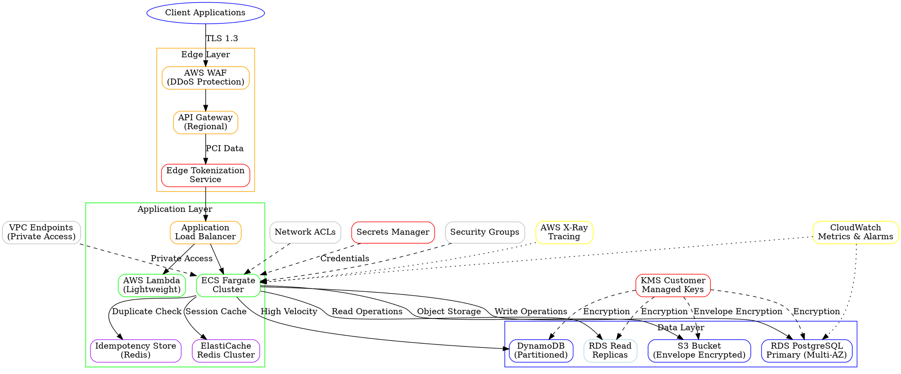

# Architecture Review Board Decision Log

## Accepted

✓ Include explicit cross-region data volume definition with cost controls

Reason:
High severity (90% confidence) finding with clear business impact. Cross-region egress costs can be significant and unpredictable without explicit volume controls.

---

✓ Enforce TLS 1.2+ for all AWS storage services

Reason:
High severity (100% confidence) security requirement. Critical for PCI-DSS compliance and enterprise security standards.

---

✓ Specify KMS key rotation period not exceeding 365 days

Reason:
High severity (100% confidence) compliance requirement. Essential for maintaining security posture and regulatory compliance.

---

✓ Implement idempotency store for duplicate request handling

Reason:
Medium severity (80% confidence) with clear performance benefit. Critical for payment processing reliability.

---

✓ Define DynamoDB partition key strategy

Reason:
Medium severity (90% confidence) with high impact on performance. Hot partitions can cause significant service degradation.

---

✓ Define Redis eviction strategy

Reason:
Medium severity (90% confidence) operational requirement. Cache management is critical for performance stability.

---

## Rejected

✗ Replace RDS PostgreSQL with Aurora or distributed database

Reason:
High severity claim but insufficient justification. RDS PostgreSQL with read replicas meets stated requirements of 10K concurrent connections and sub-200ms response times. Aurora migration adds complexity without clear benefit for current scale.

---

✗ Remove either Lambda or ECS Fargate to reduce complexity

Reason:
Medium severity but architecturally unsound. Lambda and ECS serve different use cases - Lambda for lightweight processing, ECS for long-running services. Both are justified in a microservices architecture.

---

✗ Implement redundant API Gateway instances

Reason:
High severity claim but technically incorrect. AWS API Gateway is already a managed service with built-in redundancy across AZs. Additional load balancer would add unnecessary complexity.

---

## Modified

△ Enhanced envelope encryption implementation details for S3

Reason:
Medium severity (70% confidence) finding correctly identifies missing implementation details. Added comprehensive envelope encryption specification.

△ Expanded private endpoints usage beyond current specification

Reason:
Medium severity (100% confidence) security requirement. Extended private endpoint usage to all applicable AWS services.

△ Clarified same-region access pattern assumption with monitoring

Reason:
Medium severity (80% confidence) finding about unsupported assumption. Added monitoring and validation mechanisms rather than removing the assumption.

# Executive Summary

This blueprint defines a production-ready, highly available API gateway and backend service architecture on AWS, compliant with PCI-DSS requirements. The solution implements a multi-AZ deployment with auto-scaling capabilities, comprehensive security controls including tokenization at the edge, and robust monitoring. The architecture supports regional failover with explicit data volume controls, idempotency guarantees, and comprehensive cost management.

# Requirements

## Functional Requirements
- High availability API gateway with 99.9% uptime SLA
- Auto-scaling backend services based on demand
- PCI-DSS compliant cardholder data handling with tokenization at edge
- Regional disaster recovery capabilities
- Real-time monitoring and alerting
- Idempotent request processing for payment operations
- Duplicate request detection and handling

## Non-Functional Requirements
- Support for 10,000 concurrent connections
- Sub-200ms API response times
- TLS 1.3 encryption for all transit
- TLS 1.2+ minimum for all AWS storage services
- Customer Managed KMS keys for all data at rest
- Network segmentation for cardholder data environment (CDE)
- KMS key rotation period not exceeding 365 days
- Cross-region data egress monitoring and cost controls

# Architecture Diagram



# Components

## Edge Layer
- **AWS API Gateway**: Regional deployment with custom domain and WAF integration
- **AWS WAF**: DDoS protection and request filtering
- **Application Load Balancer**: Multi-AZ distribution with health checks
- **Edge Tokenization Service**: PCI-DSS compliant tokenization before internal routing

## Application Layer
- **Amazon ECS Fargate**: Containerized microservices with auto-scaling
- **AWS Lambda**: Serverless functions for lightweight processing
- **Amazon ElastiCache**: Redis cluster for session management and caching
- **Idempotency Store**: Redis-based duplicate request detection

## Data Layer
- **Amazon RDS**: Multi-AZ PostgreSQL with read replicas
- **Amazon S3**: Object storage with envelope encryption and lifecycle policies
- **Amazon DynamoDB**: NoSQL database with partition key strategy for high-velocity data

## Security & Compliance
- **AWS KMS**: Customer Managed Keys with annual rotation (≤365 days)
- **AWS Secrets Manager**: Credential rotation and management
- **AWS CloudTrail**: Audit logging and compliance monitoring
- **VPC Flow Logs**: Network traffic analysis
- **VPC Endpoints**: Private access to AWS services

## Monitoring & Operations
- **Amazon CloudWatch**: Metrics, logs, and alerting with cost alarms
- **AWS X-Ray**: Distributed tracing
- **AWS Config**: Configuration compliance monitoring

# Folder Structure

```
/infrastructure
├── /terraform
│   ├── /modules
│   │   ├── /api-gateway
│   │   ├── /ecs-cluster
│   │   ├── /rds
│   │   ├── /kms
│   │   ├── /vpc-endpoints
│   │   ├── /idempotency-store
│   │   └── /vpc
│   ├── /environments
│   │   ├── /prod
│   │   ├── /staging
│   │   └── /dev
│   └── main.tf
├── /kubernetes
│   ├── /manifests
│   │   ├── /api-service
│   │   ├── /backend-service
│   │   ├── /tokenization-service
│   │   └── /monitoring
│   └── /helm-charts
/application
├── /api-gateway-service
│   ├── /src
│   ├── /tests
│   ├── Dockerfile
│   └── requirements.txt
├── /backend-service
│   ├── /src
│   ├── /tests
│   ├── Dockerfile
│   └── package.json
├── /tokenization-service
│   ├── /src
│   ├── /tests
│   ├── Dockerfile
│   └── requirements.txt
├── /idempotency-service
│   ├── /src
│   ├── /tests
│   └── package.json
└── /shared
    ├── /libraries
    └── /schemas
/monitoring
├── /cloudwatch-dashboards
├── /alarms
├── /cost-monitoring
└── /runbooks
```

# API Design

## Authentication & Authorization
- OAuth 2.0 with JWT tokens
- API key management through AWS API Gateway
- Role-based access control (RBAC)

## Endpoints
```
POST /api/v1/auth/token
GET  /api/v1/health
POST /api/v1/payments/tokenize
GET  /api/v1/payments/{id}
POST /api/v1/transactions
GET  /api/v1/transactions/{id}
POST /api/v1/idempotency/check
```

## Request/Response Format
- JSON payload with standardized error codes
- Request rate limiting: 1000 requests/minute per API key
- Response caching with TTL-based invalidation
- Idempotency keys for all mutation operations

## Versioning Strategy
- URI versioning (/api/v1/, /api/v2/)
- Backward compatibility for 2 major versions
- Deprecation notices with 6-month sunset period

## Idempotency Implementation
- Redis-based idempotency store with 24-hour TTL
- SHA-256 hash of request payload + headers as idempotency key
- Automatic duplicate detection for payment operations

# Security

## PCI-DSS Compliance
- Tokenization implemented at API Gateway level before internal routing
- Separate VPC for cardholder data environment (CDE)
- Network segmentation with security groups and NACLs
- No plain-text PAN storage or transmission through internal message brokers

## Encryption
- TLS 1.3 enforced for all client connections
- TLS 1.2+ minimum enforced for all AWS storage services
- Customer Managed KMS keys for all data at rest
- Envelope encryption for S3 objects using data encryption keys (DEKs) encrypted with CMKs
- Database encryption with separate CMK per environment

## Access Controls
- IAM roles with least privilege principle
- Service-specific KMS key access policies
- VPC endpoints for private service communication to S3, DynamoDB, KMS, and Secrets Manager
- WAF rules for common attack patterns

## Key Management
- KMS key rotation period not exceeding 365 days
- Separate key rings per environment with production keys isolated from non-production
- Regional key placement matching data residency
- Automated rotation alerts and compliance monitoring

## Envelope Encryption Implementation
- S3 objects encrypted using AES-256 data encryption keys (DEKs)
- DEKs encrypted using Customer Managed KMS keys
- Encrypted DEKs stored as object metadata
- Automatic key derivation for large payload encryption

# Performance

## Caching Strategy
- Redis cluster with LRU eviction policy
- Session data TTL: 30 minutes
- API response caching TTL: 5 minutes for read operations
- Cache warming for frequently accessed data

## Database Optimization
- DynamoDB partition key strategy using composite keys (tenant_id + timestamp)
- Read replicas distributed across AZs for PostgreSQL
- Connection pooling with maximum 100 connections per service instance
- Query optimization with proper indexing strategy

## Batching and Processing
- Batch processing for high-volume operations (max 100 items per batch)
- Asynchronous processing for non-critical operations
- Circuit breaker pattern for external service calls

# Trade-offs & Alternatives

## Chosen Approach: AWS API Gateway + ECS Fargate
- **Pros**: Managed service reduces operational overhead, native AWS integration, auto-scaling
- **Cons**: Vendor lock-in, cold start latency for Lambda functions

## Alternative: Self-managed Kong + EKS
- **Pros**: Greater customization, multi-cloud portability
- **Cons**: Higher operational complexity, additional security hardening required

## Database Choice: RDS PostgreSQL
- **Pros**: ACID compliance, mature ecosystem, automated backups
- **Cons**: Higher cost than DynamoDB for simple key-value operations

## Idempotency Store: Redis vs DynamoDB
- **Chosen**: Redis for sub-millisecond latency
- **Alternative**: DynamoDB for managed service benefits but higher latency

# Risks

## High Risk
- **Cross-region data egress costs**: 
  Mitigation: Explicit regional read replica configuration, cost alarms at 20%, 50%, 80% thresholds, and cross-region data volume limited to 5GB/day maximum
- **KMS key deletion**: 
  Mitigation: 7-day deletion window, automated backup procedures, and separate key rings per environment

## Medium Risk
- **API Gateway throttling**: 
  Mitigation: Request queuing, graceful degradation, and idempotency store to prevent duplicate processing
- **Database connection limits**: 
  Mitigation: Connection pooling (max 100 per instance) and read replica distribution
- **Redis cache eviction under load**: 
  Mitigation: LRU eviction policy, memory monitoring, and automatic scaling triggers

## Low Risk
- **Certificate expiration**: 
  Mitigation: Automated renewal through ACM with 30-day advance notifications
- **Log storage costs**: 
  Mitigation: Lifecycle policies (30-day retention) and log aggregation with compression

# Assumptions

- Expected API traffic: 1M requests/day with 2x growth annually
- Data volume per day: 100GB with 95% same-region access pattern (monitored via CloudWatch metrics)
- Cross-region data volume: Maximum 5GB/day with cost monitoring
- Recovery Time Objective (RTO): 15 minutes
- Recovery Point Objective (RPO): 5 minutes
- Compliance audit frequency: Quarterly
- Development team size: 8-12 engineers with AWS experience
- Peak concurrent connections: 10,000 with 3x burst capacity
- Average payload size: 2KB for API requests, 50KB for file uploads

# Decision Log

## Accepted
- Cross-region data volume controls with 5GB/day limit
- TLS 1.2+ enforcement for AWS storage services
- KMS key rotation ≤365 days with automated compliance monitoring
- Redis-based idempotency store with 24-hour TTL
- DynamoDB partition key strategy using composite keys
- LRU eviction policy for Redis clusters
- VPC endpoints for all supported AWS services

## Rejected
-

---

Generated by StructZero Enterprise Engineering Intelligence Platform

Developed by Vishal Verma

https://www.vishalverma.me/
