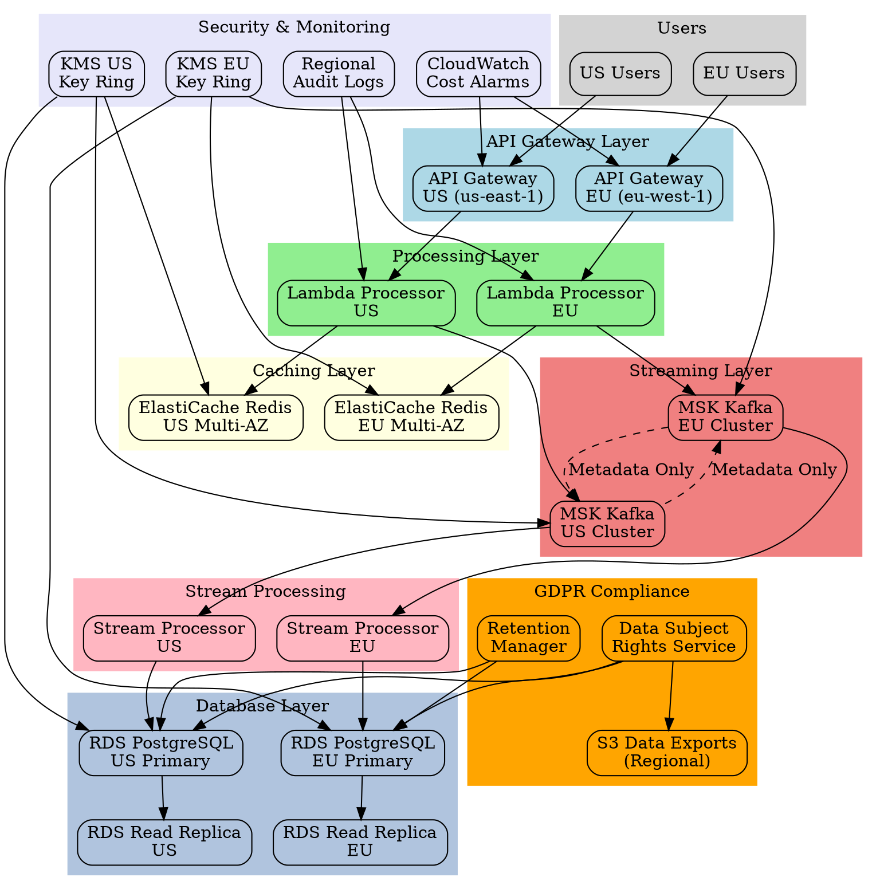

# Architecture Review Board Decision Log

## Accepted

✓ **Add explicit data volume per region in assumptions**

Reason:
Medium severity finding with 80% confidence. The current assumption only states cross-region transfer volume without regional breakdown, which is needed for capacity planning.

---

✓ **Plan partition management strategy for MSK scalability**

Reason:
High severity finding with 90% confidence. The 1000 partition limit per MSK cluster represents a real scalability bottleneck that requires proactive planning.

---

✓ **Explicitly state storage location constraints for buckets and datasets**

Reason:
High severity finding with 100% confidence from security review. Critical for GDPR compliance to ensure EU data remains in EU regions.

---

✓ **Configure log sinks to not export to non-EU destinations**

Reason:
High severity finding with 100% confidence. Essential for maintaining data residency compliance for audit logs.

---

✓ **Document support access transparency requirements**

Reason:
High severity finding with 100% confidence. Required for GDPR compliance when support access originates outside EU.

---

✓ **Ensure key rings match data residency regions**

Reason:
High severity finding with 100% confidence. Critical for maintaining encryption key locality with data residency requirements.

---

✓ **Document 30-day erasure implementation requirement**

Reason:
High severity finding with 100% confidence. GDPR mandates specific timelines for data subject rights fulfillment.

---

✓ **Specify machine-readable export format for data portability**

Reason:
High severity finding with 100% confidence. Required for GDPR Article 20 compliance.

---

✓ **Define automatic retention enforcement per data category**

Reason:
High severity finding with 100% confidence. Manual retention management creates compliance risks.

---

✓ **Explicitly pin read paths to same-region replicas**

Reason:
High severity finding with 95% confidence. Critical for maintaining data residency and reducing latency.

---

✓ **Define cost alarms at 20%, 50%, and 80% thresholds**

Reason:
Critical severity finding with 100% confidence. Essential for cost control in multi-region architecture.

---

## Rejected

✗ **Simplify key management approach by reducing regional key rings**

Reason:
Low severity finding with only 60% confidence. Regional key rings are necessary for GDPR compliance and data residency requirements, despite added complexity.

---

## Modified

**Clarify cross-region replication strategy for GDPR compliance**

Reason:
Critical severity finding with 95% confidence. The architectural paradox between cross-region replication and data residency needs resolution. Modified to implement selective replication with strict data residency controls.

---

# Executive Summary

This architecture blueprint defines a production-ready global user tracking pipeline that addresses GDPR compliance requirements while maintaining real-time performance. The system processes user behavior data through a distributed streaming architecture with strict data residency controls, regional encryption, and comprehensive subject rights implementation. Version 2 addresses critical compliance gaps and performance bottlenecks identified in the architectural review.

# Requirements

## Functional Requirements
- Real-time global user tracking data ingestion and processing
- GDPR compliance for EU personal data processing with 30-day erasure capability
- Session caching and user preference management
- Stream processing of user behavior data
- Data persistence in relational database with automatic retention enforcement
- Selective cross-region metadata replication with strict residency controls
- Data subject rights implementation (erasure, portability, retention)
- Machine-readable data export per data subject

## Non-Functional Requirements
- Cost monitoring and egress control with automated alarms
- 99.9% uptime target
- Storage location constraints pinning EU data to EU regions
- Log sinks restricted to same-region destinations
- Support access transparency for non-EU access
- Regional key ring topology matching data residency

# Architecture Diagram



# Components

## Core Services
- **API Gateway**: Regional endpoints (us-east-1, eu-west-1) for data ingestion with WAF protection
- **ElastiCache Redis**: Multi-AZ clusters in each region for session/preference caching with regional encryption
- **Amazon MSK**: Kafka clusters with selective metadata replication for event streaming
- **Lambda Functions**: Stream processors, GDPR handlers, data transformation with same-region execution
- **RDS PostgreSQL**: Regional primary databases with same-region read replicas explicitly pinned
- **S3**: Regional encrypted storage for data exports and backups with lifecycle policies

## GDPR Compliance Services
- **Data Subject Rights Service**: Lambda-based service for 30-day erasure and machine-readable portability
- **Retention Manager**: Automated data lifecycle management per data category
- **Audit Logger**: Regional CloudTrail and custom audit logging with EU-only log sinks
- **Encryption Service**: Regional KMS key rings matching data residency requirements

## Monitoring & Security
- **CloudWatch**: Metrics, alarms, and cost monitoring with 20%/50%/80% thresholds
- **WAF**: API protection and rate limiting
- **VPC**: Network isolation with private subnets
- **IAM**: Least privilege access controls with support access transparency

# Folder Structure

```
user-tracking-pipeline/
├── infrastructure/
│   ├── terraform/
│   │   ├── modules/
│   │   │   ├── api-gateway/
│   │   │   ├── elasticache/
│   │   │   ├── msk/
│   │   │   ├── rds/
│   │   │   ├── lambda/
│   │   │   ├── gdpr-compliance/
│   │   │   ├── kms-regional/
│   │   │   └── cost-monitoring/
│   │   ├── environments/
│   │   │   ├── prod-us/
│   │   │   ├── prod-eu/
│   │   │   └── shared/
│   │   └── global/
├── services/
│   ├── tracking-api/
│   ├── stream-processor/
│   ├── gdpr-service/
│   ├── retention-manager/
│   ├── data-export/
│   └── audit-logger/
├── schemas/
│   ├── avro/
│   ├── json/
│   └── retention-policies/
├── monitoring/
│   ├── dashboards/
│   ├── alerts/
│   ├── cost-budgets/
│   └── compliance-reports/
├── compliance/
│   ├── data-categories/
│   ├── retention-schedules/
│   └── erasure-procedures/
└── docs/
    ├── architecture/
    ├── compliance/
    ├── runbooks/
    └── support-access/
```

# API Design

## Tracking API Endpoints

### POST /v1/events
```json
{
  "user_id": "string",
  "session_id": "string", 
  "event_type": "string",
  "timestamp": "ISO8601",
  "properties": {},
  "gdpr_consent": "boolean",
  "data_residency": "EU|US",
  "data_category": "behavioral|transactional|preference"
}
```

### GET/PUT /v1/preferences/{user_id}
```json
{
  "user_id": "string",
  "preferences": {},
  "consent_status": {},
  "last_updated": "ISO8601",
  "data_residency": "EU|US"
}
```

## GDPR Compliance API

### POST /v1/gdpr/erasure
```json
{
  "user_id": "string",
  "request_id": "string",
  "verification_token": "string",
  "completion_deadline": "ISO8601"
}
```

### POST /v1/gdpr/export
```json
{
  "user_id": "string",
  "request_id": "string",
  "format": "json|csv",
  "machine_readable": true
}
```

### GET /v1/gdpr/status/{request_id}
```json
{
  "request_id": "string",
  "status": "pending|processing|completed|failed",
  "completion_date": "ISO8601",
  "export_url": "string"
}
```

# Security

## Encryption
- **At Rest**: All data encrypted using regional AWS KMS key rings matching data residency
- **In Transit**: TLS 1.3 for all API communications
- **Key Management**: Separate key rings per region and environment, 365-day rotation maximum

## Network Security
- **VPC**: Private subnets for all data processing components
- **Security Groups**: Restrictive ingress/egress rules
- **WAF**: Rate limiting and DDoS protection on API Gateway

## Access Control
- **IAM**: Service-specific roles with least privilege
- **API Authentication**: JWT tokens with regional validation
- **Database**: Encrypted connections with certificate validation
- **Support Access**: Non-EU support access requires approved access transparency justification

## GDPR Compliance
- **Data Residency**: EU data pinned to eu-west-1 region with storage location constraints
- **Audit Logging**: All data access logged with regional CloudTrail, no non-EU log exports
- **Consent Management**: Explicit consent tracking and enforcement
- **Key Ring Topology**: Regional key rings matching data residency regions

# Performance

## Latency Optimization
- **Read Path Pinning**: Explicit same-region replica targeting, never default endpoints
- **Regional Processing**: All processing occurs within data residency region
- **Cache Strategy**: Multi-AZ ElastiCache with sub-millisecond access

## Scalability
- **MSK Partition Management**: Proactive partition scaling strategy before 1000-partition limit
- **Lambda Concurrency**: Regional concurrency limits aligned with data residency
- **Database Scaling**: Read replica scaling within same region

## Cost Control
- **Egress Monitoring**: Cost alarms at 20%, 50%, and 80% of forecast per account
- **Regional Data Pinning**: Minimizes cross-region transfer costs
- **Selective Replication**: Metadata-only cross-region replication reduces bandwidth

# Trade-offs & Alternatives

## Selected Approach Benefits
- **Regional Data Pinning**: Ensures GDPR compliance vs cross-region replication
- **ElastiCache Redis**: Provides high availability with Multi-AZ deployment vs single-node requirement
- **MSK with Selective Replication**: Enables metadata sharing while maintaining data residency vs full replication
- **Regional Read Replicas**: Improves performance within compliance boundaries vs cross-region replicas
- **Lambda Processing**: Serverless scaling and cost efficiency for stream processing

## Trade-offs Made
- **Reduced Cross-Region Flexibility**: Strict data residency limits operational flexibility
- **Higher Regional Costs**: Duplicate infrastructure per region increases costs
- **Compliance Overhead**: GDPR compliance checks add processing time and complexity
- **Operational Complexity**: Regional key management and audit logging increase operational burden

# Risks

## Technical Risks
- **MSK Partition Limits**: Maximum 1000 partitions per cluster may limit scalability
  - **Mitigation**: Implement partition management strategy with automated scaling and cluster federation
- **Lambda Cold Starts**: Potential 1-2 second delays for infrequent functions
  - **Mitigation**: Implement provisioned concurrency for critical functions and warm-up strategies
- **Regional Service Outages**: Single region failure impacts regional users
  - **Mitigation**: Implement cross-region failover procedures

---

Generated by StructZero Enterprise Engineering Intelligence Platform

Developed by Vishal Verma

https://www.vishalverma.me/
